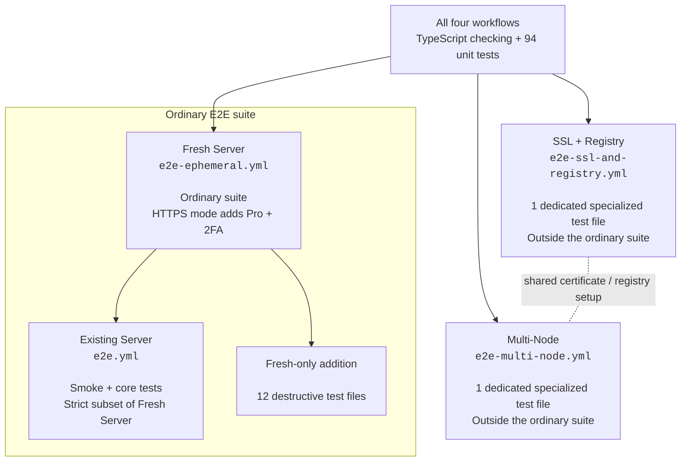

# CapRover E2E

External end-to-end tests for CapRover. The suite can run against an existing
disposable server or provision a fresh DigitalOcean server and Cloudflare DNS
record for a clean-room run.

The suite validates each lifecycle change from three independent perspectives:

- CapRover API state through the published `caprover-api` package
- Docker Swarm state over SSH
- Publicly observable HTTP behavior

## Covered lifecycle

The initial suite runs one sequential application lifecycle:

1. Validate CapRover, SSH, Docker, and Swarm manager access.
2. Create an app and wait for its placeholder service.
3. Rename the app.
4. Add and verify an environment variable.
5. Deploy a pinned Alpine-based Nginx image.
6. Scale to two instances.
7. Scale back to one instance.
8. Deploy a different pinned Nginx image.
9. Delete the app and verify its Nginx response disappears.

The suite supports the current `<appName>` Docker service naming and the legacy
`srv-captain--<appName>` naming used by older CapRover installations.

## Requirements

- Node.js 22.12 or newer
- For existing-server runs: a disposable CapRover installation with a configured
  root domain
- Public wildcard DNS for application subdomains
- Port 80 reachable from the test runner (and port 443 for HTTPS runs)
- SSH access to the Docker Swarm manager
- Docker access for the configured SSH user

For existing-server runs, the CapRover URL must use HTTPS and be the dashboard
origin, for example:

```text
https://captain.example.com
```

Do not include `/api/v2`, a trailing path, query parameters, or a fragment.

## Local development

Install dependencies:

```bash
npm ci
```

To run against an existing disposable CapRover server, create your local
environment file and fill in the server values:

```bash
cp .env.template .env
npm test
```

`.env` is gitignored and is loaded automatically only for local runs. CI systems
such as GitHub Actions provide their environment variables directly and do not
load `.env`.

The SSH host defaults to the hostname from `CAPROVER_URL`. Set `SSH_HOST`
explicitly only when SSH is exposed through a different hostname or IP address.
`SSH_PORT` is optional and defaults to `22`.

To provision a fresh server, run the tests, and destroy the temporary
infrastructure in one command, fill in the ephemeral provisioning values in
`.env` and run:

```bash
npm run test:ephemeral
```

The workflow uses `npm run provision` and `npm run destroy` as lower-level
commands. For local end-to-end runs, prefer `npm run test:ephemeral` so the
generated connection details are passed directly to the test process.

By default, `provision` creates one DigitalOcean droplet, creates a unique
unproxied Cloudflare wildcard DNS record, verifies Docker is available, starts a
fresh CapRover instance, configures its root domain, and generates a temporary
CapRover password. `E2E_PROVISION_WORKER=true` adds the optional second droplet
used by the multi-node suite. The default DigitalOcean image has Docker
preinstalled; custom images still use the existing Docker installation fallback
when needed. The generated cleanup state is stored locally in
`.e2e-provisioning-state.json` and is gitignored.

See [Provisioning design](provisioning/README.md) for the full lifecycle,
failure-recovery behavior, credential flow, and code layout.

The default provisioning configuration uses `nyc3`, `s-1vcpu-2gb`,
`docker-20-04`, and `caprover/caprover-edge`. These can be overridden with
`DIGITALOCEAN_REGION`, `DIGITALOCEAN_SIZE`, `DIGITALOCEAN_IMAGE`, and
`CAPROVER_IMAGE`.

The test output never prints the CapRover password or SSH private key. Failure
diagnostics include sanitized CapRover state, Docker service state, task state,
and a bounded tail of logs from the generated test application.

## GitHub Actions

### Workflow coverage

| Workflow                   | Purpose                                                                                   | Infrastructure             |
| -------------------------- | ----------------------------------------------------------------------------------------- | -------------------------- |
| `e2e-multi-node.yml`       | Multi-node worker joining, placement, self-hosted registry, and persistent-volume testing | 2 droplets, 2 certificates |
| `e2e-ephemeral.yml`        | Full fresh-server suite; HTTPS mode also runs Pro and 2FA coverage                        | 1 droplet, HTTP by default |
| `e2e-ssl-and-registry.yml` | Dedicated SSL and self-hosted registry coverage                                           | 1 droplet, 4 certificates  |
| `e2e.yml`                  | Run the ordinary non-destructive suite against an existing server you provide             | No provisioning            |



### Existing server

The existing **CapRover E2E** workflow runs manually through **Actions → CapRover
E2E → Run workflow** and reuses an already-provisioned server.

Configure these repository secrets first:

| Secret                         | Description                                           |
| ------------------------------ | ----------------------------------------------------- |
| `CAPROVER_E2E_PASSWORD`        | Password configured on the disposable CapRover server |
| `CAPROVER_E2E_SSH_PRIVATE_KEY` | Private key matching an authorized key on the server  |

Each run asks for:

- CapRover dashboard URL
- SSH user
- SSH port

The SSH host is derived from the CapRover dashboard URL. The workflow only
supplies configuration and runs `npm test`; all test logic lives in the
TypeScript suite.

### Fresh server

The **CapRover E2E - Fresh Server** workflow provisions a new environment, runs
the smoke, core, and ordinary destructive suites, and destroys its temporary
infrastructure even when the test step fails.

Run it normally to use HTTP without issuing a certificate. Check **Enable HTTPS**
to issue a real Let's Encrypt certificate, force dashboard HTTPS, run the
ordinary suite over HTTPS, and then run the Pro and 2FA specialized coverage on
the same server. HTTPS runs require the dedicated `E2E_PRO_API_KEY` secret and
share the certificate-issuing concurrency group with the other certificate
workflows. Local `npm run test:ephemeral` still defaults to HTTP; setting
`E2E_ENABLE_HTTPS=true` locally only enables HTTPS provisioning and does not
automatically invoke the separate Pro/2FA npm command. Both modes use HTTP for
application subdomains unless a test explicitly enables SSL on an app.

Configure these repository secrets:

| Secret                         | Description                                                    |
| ------------------------------ | -------------------------------------------------------------- |
| `DIGITALOCEAN_TOKEN`           | DigitalOcean API token with droplet access                     |
| `DIGITALOCEAN_SSH_KEY_ID`      | DigitalOcean ID of the public key matching the SSH private key |
| `CLOUDFLARE_API_TOKEN`         | Cloudflare API token with DNS edit access                      |
| `CLOUDFLARE_ZONE_ID`           | Cloudflare zone ID containing the E2E base domain              |
| `E2E_BASE_DOMAIN`              | Base domain under which temporary wildcard records are created |
| `CAPROVER_E2E_SSH_PRIVATE_KEY` | Private key matching the DigitalOcean SSH key                  |
| `E2E_PRO_API_KEY`              | Dedicated Pro instance key; required only for HTTPS runs       |

The fresh-server workflow uses a generated CapRover password for each run. The
existing-server workflow remains available for fast repeated test runs without
reprovisioning infrastructure.

### Controlled SSL and self-hosted registry coverage

The manual **CapRover E2E - SSL and Registry** workflow provisions its own
ephemeral server with dashboard HTTPS enabled and runs only
`tests/specialized/ssl-and-registry.test.ts`. It verifies trusted certificates
for an app's base domain and custom domain, app-level force-SSL redirects, and
the self-hosted registry's API, Docker service, TLS endpoint, default-push
behavior, deletion protections, image contents, and cleanup.

The workflow uses the same six provisioning secrets as the normal fresh-server
workflow. Provisioning validates them before creating a droplet. The workflow is
manual-only and serialized with other certificate-issuing E2E workflows.

Each complete run requests four Let's Encrypt certificates: dashboard, app,
custom domain, and registry. [Let's Encrypt currently permits 50 certificates
per registered domain in a rolling seven-day period](https://letsencrypt.org/docs/rate-limits/#new-certificates-per-registered-domain).
Manage its four-certificate cost together with the multi-node workflow's
two-certificate cost and the fresh-server HTTPS mode's one-certificate cost.
Keep `4 × SSL runs + 2 × multi-node runs + HTTPS fresh-server runs` at or below
40 per rolling seven days for the configured base domain. This leaves room for
interrupted attempts and other HTTPS runs. A failed run may consume part of its
certificate budget.

Dispatch the specialized workflow with:

```bash
gh workflow run e2e-ssl-and-registry.yml
```

### Multi-node coverage

The manual **CapRover E2E - Multi-Node** workflow provisions a CapRover manager
and a separate Docker worker. It enables the self-hosted registry, adds the
worker through CapRover's node API, cross-checks node state with Docker Swarm,
and verifies that source-built stateless and persistent applications run when
pinned to the worker. The persistent case writes data to the worker-local named
volume, replaces the task image, and verifies the data remains.

Set `E2E_PROVISION_WORKER=true` only for a run that needs the second droplet.
Provisioning exports its address as `E2E_WORKER_IP`, records its identifier for
failure recovery, and destroys it independently from the manager. This workflow
uses the same six provisioning secrets, is manual-only, and shares the
certificate-issuing concurrency group with the SSL workflow.

Each complete multi-node run requests two Let's Encrypt certificates, one for
the dashboard and one for the self-hosted registry. Its dispatches count toward
the shared certificate budget described above.

Dispatch it with:

```bash
gh workflow run e2e-multi-node.yml
```

### Pro and two-factor authentication coverage

The **CapRover E2E - Fresh Server** workflow includes
`tests/specialized/pro-and-2fa.test.ts` whenever **Enable HTTPS** is checked. The
ordinary fresh-server suite runs first over HTTPS, then the Pro/2FA test claims a
dedicated Pro key, checks subscription state and Pro configuration, requests a
fresh TOTP URI, enables two-factor authentication, verifies login requires an
OTP, and logs in with a generated code. Test cleanup disables 2FA and restores
the initial Pro configuration before infrastructure teardown.

Configure `E2E_PRO_API_KEY` as an Actions secret containing an instance key
reserved solely for this suite. The Pro service updates the key's associated
hostname on each claim and replaces its stored TOTP secret on setup, so the
same key works across fresh runs. The Pro service retains the most recent
hostname until the next claim; keep the key separate from any live server.
HTTPS fresh-server runs validate the secret before provisioning, share the
certificate-issuing concurrency group with the SSL and multi-node workflows,
and request one dashboard certificate per complete run.

Dispatch the combined HTTPS + Pro/2FA mode with:

```bash
gh workflow run e2e-ephemeral.yml -f enable_https=true
```

### Git webhook coverage

The standard **CapRover E2E - Fresh Server** workflow includes
`tests/git-webhooks.test.ts` in its destructive tier. Persistent-server runs
continue to exclude it.

Run the setup script from a local checkout to create the dedicated **private**
repository, populate its fixture commit, install a read-only SSH deploy key, and
set all seven `E2E_GIT_*` Actions secrets:

```bash
./scripts/setup-git-fixture.sh
```

The script requires `gh`, `git`, `ssh`, and `ssh-keygen`. Authenticate `gh` with
an account that can create the fixture repository and administer Actions
secrets in `caprover/caprover-e2e`. GitHub does not expose an API for creating a
fine-grained personal access token, so the script prompts without echoing for a
token with read-only **Contents** access to the fixture repository. You can also
provide it as `CAPROVER_E2E_GIT_HTTP_TOKEN`. The explicit `--use-gh-token`
fallback uses the current GitHub CLI token, which may have access to more than
the fixture repository. Run `./scripts/setup-git-fixture.sh --help` to override
the repository names or branch.

The resulting private repository contains the file
[`tests/fixtures/git-webhook-repo/captain-definition`](tests/fixtures/git-webhook-repo/captain-definition)
at its root on the configured branch. Pin the branch to that fixture commit
while running this workflow. Give CapRover read access through both a
fine-grained read-only GitHub token and a read-only deploy key. Use a separate
key from the one used to SSH into the DigitalOcean server. No GitHub webhook
needs to be installed: the test sends the GitHub push payload directly to
CapRover and verifies the resulting Git clone and deployment.

Configure the fresh-server secrets listed above and these additional secrets
in the `caprover-e2e` repository:

| Secret                    | Value                                                   |
| ------------------------- | ------------------------------------------------------- |
| `E2E_GIT_HTTPS_REPO`      | `https://github.com/owner/private-fixture.git`          |
| `E2E_GIT_SSH_REPO`        | `git@github.com:owner/private-fixture.git`              |
| `E2E_GIT_BRANCH`          | Branch containing the pinned fixture commit             |
| `E2E_GIT_HTTP_USER`       | Git username, commonly `x-access-token`                 |
| `E2E_GIT_HTTP_PASSWORD`   | Read-only fine-grained GitHub token for that repository |
| `E2E_GIT_SSH_PRIVATE_KEY` | Unencrypted private key for the read-only deploy key    |
| `E2E_GIT_EXPECTED_COMMIT` | Full 40-character SHA of the fixture commit             |

The fresh-server workflow checks that settings exist before creating a droplet. The test
also checks both URLs point to the same repository and compares the Git hash
from each build to the expected commit. Git credentials and webhook tokens are
never included in assertions. Failure diagnostics redact raw, newline-expanded,
and URL-encoded credential values before printing captain logs. Dispatch the
normal fresh-server workflow with:

```bash
gh workflow run e2e-ephemeral.yml
```

## Development checks

```bash
npm run typecheck
npm run format
```

The test creates unique application names and performs best-effort cleanup for
both the original and renamed names. Cleanup warnings preserve the original test
failure.

## Test tiers and safety

| Command                                     | Selection                                                               |
| ------------------------------------------- | ----------------------------------------------------------------------- |
| `npm test`                                  | Type checking, then `test:all`                                          |
| `npm run test:unit`                         | Local unit tests, no server required                                    |
| `npm run test:smoke`                        | Existing application lifecycle                                          |
| `npm run test:core`                         | Explicitly listed app-scoped tests on a dedicated test server           |
| `npm run test:destructive`                  | Explicitly listed global and destructive tests; requires ephemeral mode |
| `npm run test:specialized:ssl-and-registry` | Controlled SSL and registry file; requires ephemeral mode               |
| `npm run test:specialized:multi-node`       | Two-node placement and persistence file; requires ephemeral mode        |
| `npm run test:specialized:pro-and-2fa`      | Pro claim and OTP login file; requires ephemeral mode                   |
| `npm run test:all`                          | Unit, smoke, core; adds ordinary destructive tests in ephemeral mode    |

Provisioning sets `CAPROVER_E2E_ENVIRONMENT=ephemeral` for the test process.
Leave this unset for existing servers. This flag declares a disposable environment;
set it only for a freshly provisioned server owned by the run. Never point the suite
at a production server. Each future destructive file must call `requireEphemeral()`
before creating a context or mutating resources. Direct file filters cannot expand
the selected tier. Specialized tests under `tests/specialized/` are excluded from all default
selections and run only through their explicit workflow modes. Git webhook
coverage is part of the ordinary destructive tier because its fixture prerequisites
are validated before fresh-server provisioning.

Core and destructive commands fail with no tests until their files are implemented.
Existing-server workflow runs are serialized without cancelling an active run.
Coordinate local runs separately to avoid concurrent mutations of the same server.

New resource tests use `withCleanup()`: register cleanup before a named resource's
create request, scope it to that run's exact resource, and tolerate an already-absent
resource. Cleanup runs in reverse order and attempts all actions. A cleanup failure
fails the run, and an original test failure is retained alongside cleanup failures.
The existing smoke lifecycle keeps its original best-effort cleanup behavior.

Provisioning logs the requested CapRover image, and environment validation logs
the running service image reference including its digest when Docker resolves one.
For reproducible prerequisite validation, set `CAPROVER_IMAGE` to a known digest
containing the required backend fix and retain the run's image output.

Authentication coverage exercises valid login, empty/oversized password validation,
one wrong-password attempt, SDK error propagation, and an unauthenticated request.
Rapid repeated runs can encounter the server's global failed-login backoff; wait
for that window to expire before retrying. Root-domain setup and password change
are covered by every fresh-server run; root SSL and global force SSL are covered
when **Enable HTTPS** is checked.

## Source uploads

Source uploads require `caprover-api@0.0.22` or newer, which includes the merged
[native FormData fix](https://github.com/caprover/caprover-api/pull/9).
The fixture uses the runner's `tar` executable and a digest-pinned Nginx image;
it creates unique HTTP and Unicode startup-log markers without extra dependencies.
