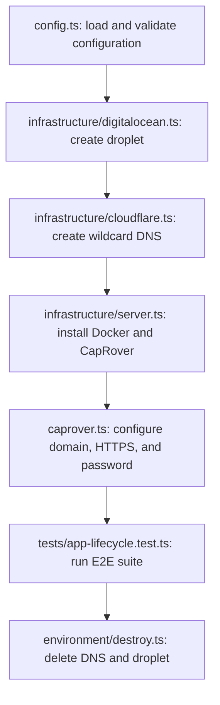
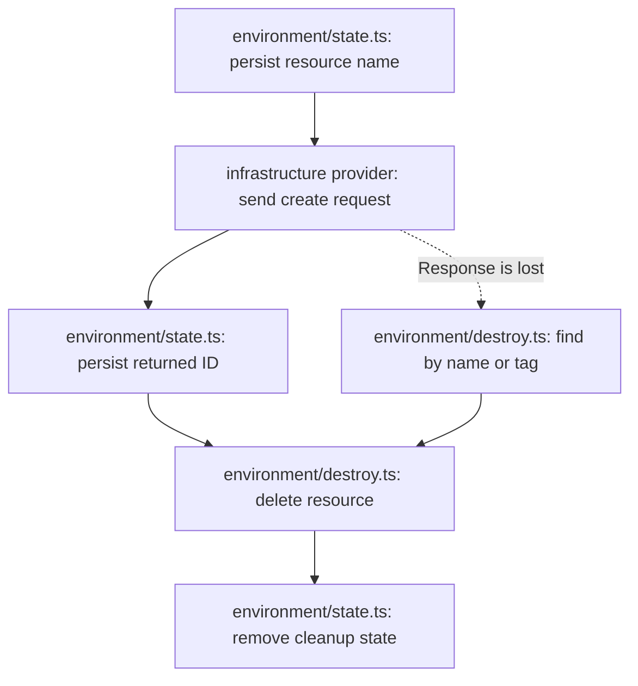

# Provisioning design

This directory contains the fresh-server lifecycle used by local ephemeral runs
and the **CapRover E2E - Fresh Server** GitHub Actions workflow. The existing
server workflow does not use this code.

## Lifecycle

The provisioner returns the same environment variables accepted by the regular
test suite:

- `CAPROVER_URL` and `CAPROVER_PASSWORD` for the CapRover API
- `SSH_HOST`, `SSH_PORT`, `SSH_USER`, and `SSH_PRIVATE_KEY` for Docker inspection

GitHub Actions writes these values to `GITHUB_ENV` between the provisioning and
test steps. `npm run test:ephemeral` passes them directly to the test child
process during local runs.

## Commands

| Command                  | Behavior                                                                                                 |
| ------------------------ | -------------------------------------------------------------------------------------------------------- |
| `npm run provision`      | Creates and configures an environment. In GitHub Actions, exports its connection values to `GITHUB_ENV`. |
| `npm run destroy`        | Loads the cleanup state and removes any remaining DNS record and droplet.                                |
| `npm run test:ephemeral` | Provisions, runs `npm test`, and destroys the environment in one local process.                          |

The GitHub Actions workflow uses separate `provision`, test, and `destroy` steps
so test failures remain visible and the cleanup step can use `if: always()`.

## Code layout

| Path                             | Responsibility                                                |
| -------------------------------- | ------------------------------------------------------------- |
| `commands/`                      | Executable entry points used by the npm scripts               |
| `environment/provision.ts`       | Coordinates the complete creation and configuration flow      |
| `environment/destroy.ts`         | Reconciles and deletes partial or complete environments       |
| `environment/state.ts`           | Persists cleanup state atomically                             |
| `infrastructure/digitalocean.ts` | Creates, finds, polls, and deletes droplets                   |
| `infrastructure/cloudflare.ts`   | Creates, finds, and deletes wildcard DNS records              |
| `infrastructure/server.ts`       | Connects over SSH, installs Docker, and starts CapRover       |
| `caprover.ts`                    | Configures DNS, root domain, HTTPS, and generated credentials |
| `config.ts`                      | Loads required credentials and optional provisioning defaults |
| `retry.ts`                       | Provides bounded retry and timeout behavior                   |
| `types.ts`                       | Defines the persisted and returned environment contracts      |

## Cleanup state and failure recovery

Provisioning persists `.e2e-provisioning-state.json` after every meaningful
resource change. The file contains resource identifiers and public connection
details, but no passwords, API tokens, or SSH private keys.

Resource names are saved before provider create requests. If a provider creates
a resource but its response is lost, cleanup can recover the DigitalOcean
droplet by its unique tag and the Cloudflare record by its unique DNS name.

State writes use a temporary file followed by an atomic rename. An interrupted
write therefore leaves the previous valid cleanup state available. DNS and
droplet deletion are attempted independently, and partial deletion failures
leave enough state for a later `npm run destroy` retry.

Provisioning also performs immediate best-effort cleanup when any creation or
configuration step fails. The GitHub Actions cleanup step is a second attempt
that runs after successful tests, failed tests, or a failed provisioning step.

An abrupt runner loss can still prevent workflow cleanup. In that case, cleanup
requires the state file from the interrupted runner or manual provider cleanup
using the `caprover-e2e` droplet tag and generated `e2e-*` DNS name.

## Credential lifecycle

Each environment uses two random 28-character CapRover passwords:

1. The installation password is passed to the CapRover installer and used while
   configuring the root domain and enabling HTTPS.
2. After HTTPS is available, the provisioner replaces it with a separate test
   password and verifies that the new credentials work.

CapRover rejects passwords longer than 29 characters, which is why the generator
uses 21 random bytes encoded as a 28-character Base64URL value.

GitHub Actions masks both generated passwords and the generated root domain. The
test password exists only in the current process or workflow environment. The
static SSH private key is supplied through configuration and is never written to
the cleanup state.

## Configuration

Required credentials and identifiers are documented in the repository
[README](../README.md#fresh-server). Optional infrastructure settings default to:

| Variable              | Default                  |
| --------------------- | ------------------------ |
| `DIGITALOCEAN_REGION` | `nyc3`                   |
| `DIGITALOCEAN_SIZE`   | `s-1vcpu-2gb`            |
| `DIGITALOCEAN_IMAGE`  | `ubuntu-24-04-x64`       |
| `CAPROVER_IMAGE`      | `caprover/caprover-edge` |

Local execution loads a gitignored `.env` file. CI supplies environment variables
directly and does not load `.env`.
